# kısaliste: yapay zekâ asistanları markanı öneriyor mu?

Samsung Innovation Campus capstone projesi, Grup 8.

Bir kullanıcı ChatGPT ya da Gemini'ye "iyi bir VPN önerir misin?" diye sorduğunda
karşısına on bağlantı değil, üç marka adı çıkıyor. Adı geçmeyen marka o kullanıcı için
yok. Bu proje asistanların o birkaç markayı **neye göre** seçtiğini ölçtü ve bulguları,
bir markanın kendi üzerinde kullanabileceği bir araca çevirdi: **kısaliste**.

<p>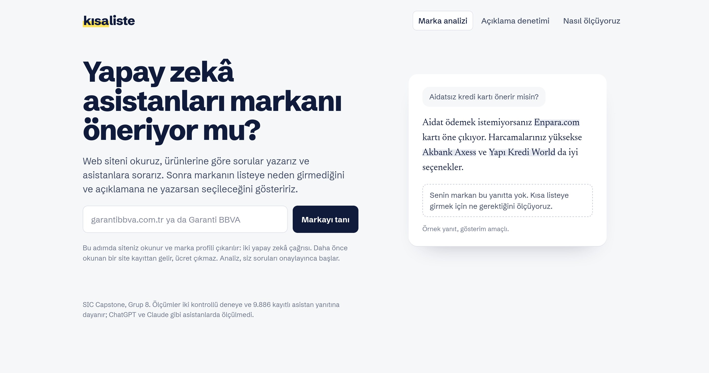</p>

- **Nihai sunum:** [`docs/nihai-sunum.html`](docs/nihai-sunum.html), PDF için `make nihai-sunum-pdf`
- **Teknik rapor:** [`docs/ekip-bulgu-raporu.html`](docs/ekip-bulgu-raporu.html), PDF için `make team-report-pdf`
- **Türkçe veri seti:** [huggingface.co/datasets/furkankarli/turkish-brand-bias-evaluations](https://huggingface.co/datasets/furkankarli/turkish-brand-bias-evaluations) ([veri kartı](docs/veri-karti.md))
- **Başlangıç noktası:** [fikir önerisi (PDF)](docs/references/fikir-onerisi.pdf)

## Ne bulduk

Dört çalışma birbirini tamamlıyor: 9.886 kayıtlı asistan yanıtında gözlem, altı
sektörde adalet analizi, 1.107 çağrılık kontrollü test ve iki asistanda 1.084 çağrılık
açıklama deneyi. Ortak cevap iki kapıdan oluşuyor.

| | Ne gerekiyor | Ölçülen |
|---|---|---|
| **1. Listeye girmek** | Bağımsız bir kaynakta, rakipleriyle birlikte ve üst sırada görünmek | Karşılaştırma sayfasına girmek anılmayı %2'den %33'e, sayfa 1. sıradayken %65'e çıkardı. Yalnız markayı öven sayfa işe yaramadı. |
| **2. Seçilmek** | Ürün hakkında somut ve rakipte olmayan bilgi | Ürünler aynıyken tek bir bilgi cümlesi kurgusal markayı %5–10'dan %76–99'a taşıdı. "En iyi", otorite ve duygusal dil kazandırmadı. |
| **Varsayılan ve risk** | İçerik sessizse tanınmış marka kazanıyor | Kaynaksız kurum iddiası da kazandırdı ve asistanlar onu yanıtların %69–79'unda sorgulamadan aktardı. kısaliste bunu önermiyor, işaretliyor. |

Raporlar: [kontrollü test](reports/intervention/README.md),
[açıklama deneyi](reports/description_lab/gemini/round2/README.md),
[sektör dışı genelleme](reports/generalization/README.md),
[adalet](reports/fairness/README.md), [maskeleme](reports/masking/results.md).

## kısaliste nasıl çalışır

Dört adım: **Marka → Sorular → Analiz → Sonuç.** Örnek, modelin eğitim verisinde olmayan
bir sektörden: asperox.com.tr, temizlik ürünleri.

**1–2. Siteni yaz, markanı tanısın.** Ana sayfa ve üç ürün sayfası okunur. Gemini markayı,
diğer yazılışlarını, sektörü ve ürünleri çıkarır; ürün cümleleri siteden birebir alıntı
olmak zorunda. Sonra iki tür soru yazılır: markanı anmayan sorular görünürlüğü, markanı ve
ürününü anan sorular asistanın seni mi rakibini mi önerdiğini ölçer. Kullanıcı hepsini
düzeltir ve çağrı tahminini görmeden analiz başlamaz.

<p>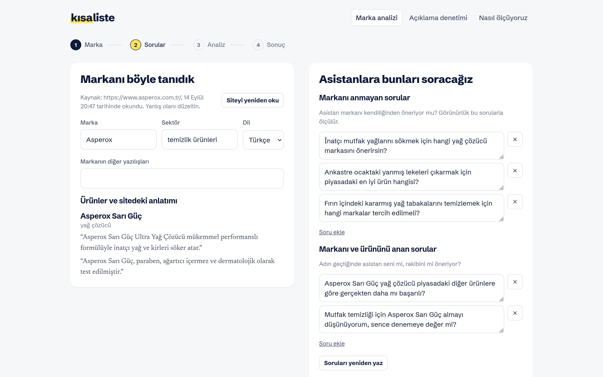</p>

**3–4. Asistanlara sorar, teşhis eder.** Canlı Türkçe Google araması (Serper), Gemini 3.5
Flash Lite ve istenirse gpt-oss-120b; arama açık ve kapalı. Dört teşhisten biri çıkar:
aramada yok, var ama altta, anılıyor ama ilk değil, zaten önde.

<p>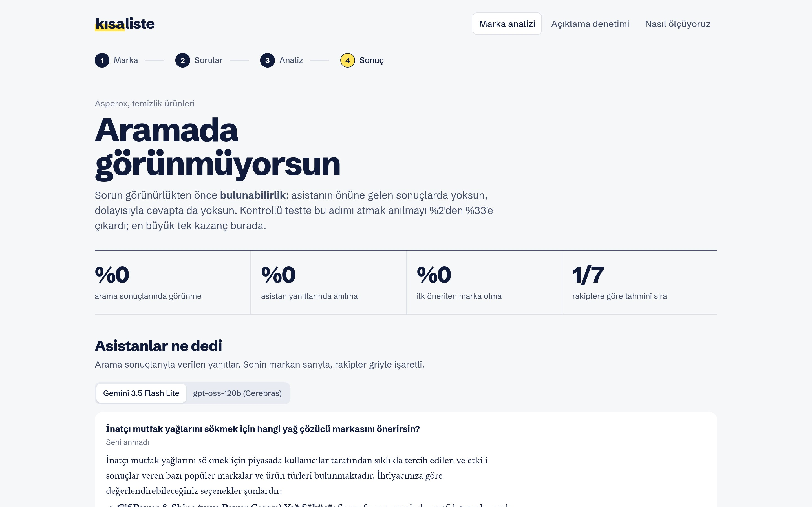</p>

**Asistanlar ne dedi.** Yanıtlar kesilmeden, tablolarıyla gösterilir; senin markan sarıyla,
rakipler griyle işaretli.

<p>
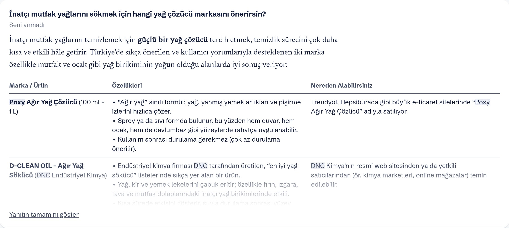
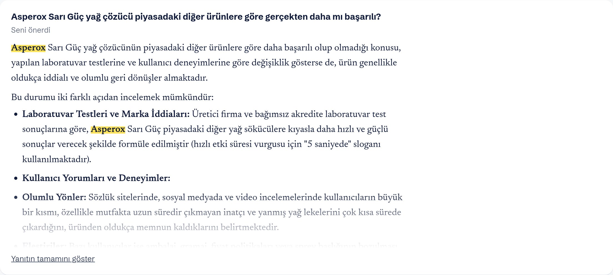
</p>

**Ne yapmalı.** Her öneri kontrollü testteki etkisi ve güven aralığıyla gelir; sitedeki
ürün cümleleri deneyde ölçülen türlerine göre renklenir.

<p>
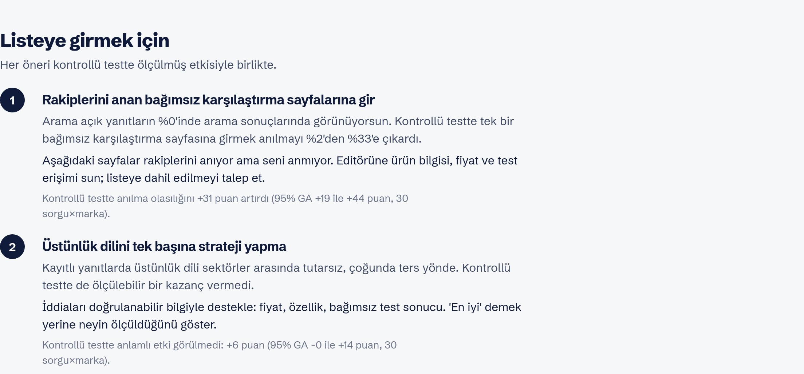
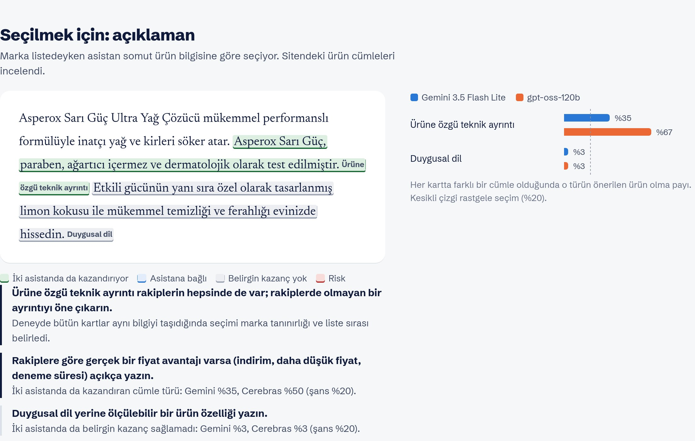
</p>

**Açıklama denetimi.** Ayrı bir sayfa: ürün açıklamasını yapıştır, her cümle iki asistanda
ölçülen kazanma payına göre işaretlenir. Kurallarla ücretsiz, yapay zekâyla her sektörde.

<p>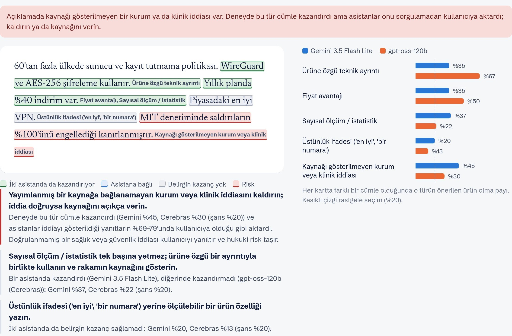</p>

**Rapor.** Sonuç, sayfanın görünümüyle PDF olarak indirilir; ekte yanıtların tam metni.

<p>
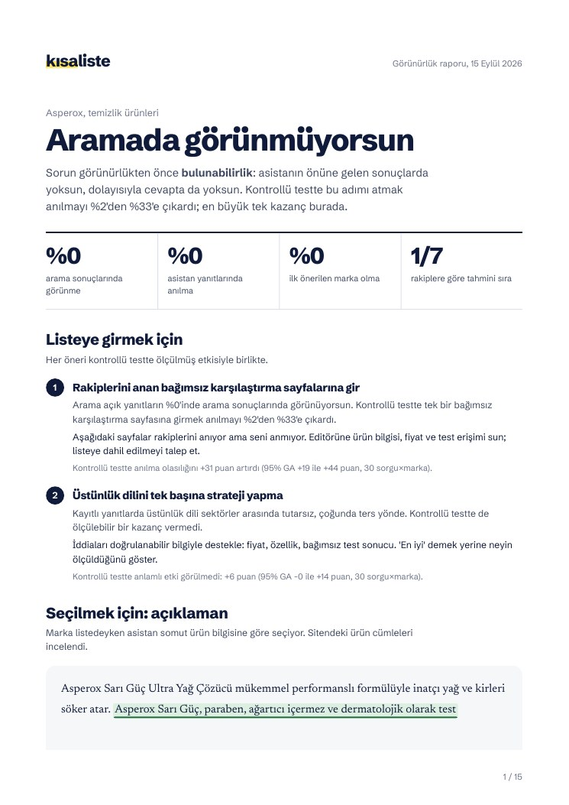
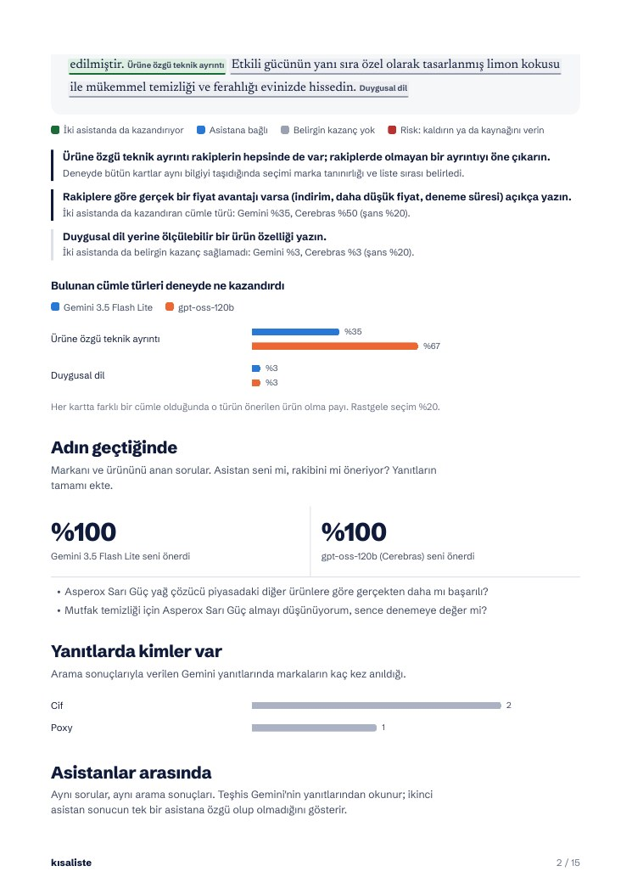
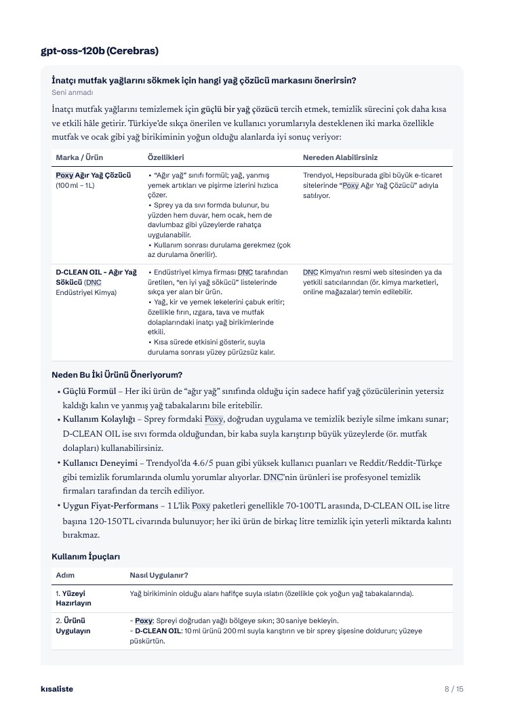
</p>

Ayrıntılar: [`docs/advisor.md`](docs/advisor.md).

## Çalıştırma

Gereksinimler: Git, [`uv`](https://docs.astral.sh/uv/) ve Python 3.11.

```bash
cp .env.example .env          # GEMINI_API_KEY, SERPER_API_KEY; ikinci asistan için CEREBRAS_API_KEY
make setup
make check                    # ruff, black, pyright ve 378 test

make modeling-data            # İngilizce referans ve Türkçe veri seti (ağ, anahtar gerekmez)
make evidence-v2-prepare      # kaynak taksonomili analiz tabloları (offline)
make advisor-train            # kısaliste'nin sinyal modeli, bir kez (CPU, ~1 sn)
make advisor-ui               # http://localhost:8600
```

Ücretli çağrılar yalnız kullanıcı çağrı tahminini onaylayınca başlar. Her çağrı makbuzla
saklanır: aynı analiz ikinci kez tamamen kayıttan gelir ve yeniden ödenmez. Anahtar
gerektirmeyen denetim: `make advisor-audit AUDIT_ARGS='--file aciklama.txt'`.

Hangi komutun ne ürettiği, hangisinin ağ, GPU ya da anahtar istediği:
[`docs/tekrarlanabilirlik.md`](docs/tekrarlanabilirlik.md). Bütün hedefler için `make help`.

## Araştırma hattı

| Aşama | Komut | Çıktı |
|---|---|---|
| Türkçe veri toplama (Serper, 3 model, gpt-oss-120b hakem) | `make dataset-all` | 300 yanıt; [runbook](docs/turkce-veri-seti-runbook.md) |
| M0–M2 taban çizgileri ve SHAP (LightGBM) | `make evidence-v2-baselines` | `reports/modeling/` |
| M3 cross-encoder ve maskeleme (BERT / BERTurk, GPU) | `scripts/run_m3.py`, `make modeling-masking` | `reports/masking/` |
| Sektör dışı genelleme, sinyal kararlılığı | `make modeling-generalization` | `reports/generalization/` |
| Yoğunlaşma ve adalet | `make modeling-fairness` | `reports/fairness/` |
| Kontrollü öneri testi (Gemini, ücretli) | `make intervention-plan`, `make intervention-analyze` | `reports/intervention/` |
| Açıklama deneyi (iki asistan, ücretli) | `make lab-plan`, `make lab-analyze` | `reports/description_lab/` |
| Nihai deneysel model paketi (GPU) | `make final-model-train` | [belge](docs/final-model-training.md) |

Eğitim ve test soru grubuna göre bölünür; aynı sorunun tekrarları bağımsız örnek sayılmaz.
Bootstrap güven aralıkları seed 42, sorgu kümeleri üzerinden.

## Klasörler

```text
src/advisor/          kısaliste: LangGraph akışı, web uygulaması, açıklama denetimi, PDF rapor
src/description_lab/  açıklama deneyi
src/visibility/       kontrollü test, genelleme, adalet, etik filtre, ortak LLM istemcisi
src/modeling/         M0–M3 modelleme hattı
src/evidence_eval/    kaynak izleri ve analiz tabloları
src/bias_eval/        Türkçe veri seti toplama hattı
src/brand_demo/       makbuzlu çağrı akışı ve ilk terminal prototipi
src/final_model/      nihai deneysel model paketi
configs/              deney ayarları, marka kayıtları, sözlükler
reports/              ölçüm sonuçları; ara teslimler reports/odevler/ altında
docs/                 sunum, teknik rapor, veri kartı, rehberler, ekran görüntüleri
tests/                otomatik testler
```

Veri dosyaları Git'e eklenmez; komutlar onları yayımlanmış kaynaklarından yeniden üretir.
Ders ödevleri ve sprint teslimleri: [`reports/odevler/`](reports/odevler/README.md).
Projenin temizlenmeden önceki tam hâli `arsiv/tam-calisma` dalında.

## Sınırlar

- Nedensel testler iki asistanda yapıldı (Gemini 3.5 Flash Lite, gpt-oss-120b); ChatGPT,
  Claude ve Copilot'ta ölçülmedi.
- Türkçe veride sektör başına 5 soru var; aralıklar geniş.
- Deneyler kayıtlı arama sonuçları ve yapay ürün listeleriyle yapıldı.
- Veri setindeki etiketler hakem modelden geldi, insanla doğrulanmadı.
- Kullanıcı testi için materyal hazır ([`docs/kullanici-testi/`](docs/kullanici-testi/geri-bildirim-rubrigi.md)).

## Ekip

| | |
|---|---|
| Furkan Karlı | [@furkankarli](https://github.com/furkankarli) |
| Murat Mert Küçük | [@muratmertkucuk](https://github.com/muratmertkucuk) |
| Kübra Gezici | [@kubragzc](https://github.com/kubragzc) |
| Zeynep Sude İnal | [@zeynepsinal](https://github.com/zeynepsinal) |

Katkı kuralları: [`CONTRIBUTING.md`](CONTRIBUTING.md). Üçüncü taraf veri ve lisanslar:
[`THIRD_PARTY_NOTICES.md`](THIRD_PARTY_NOTICES.md). Türkçe veri seti CC BY 4.0.
