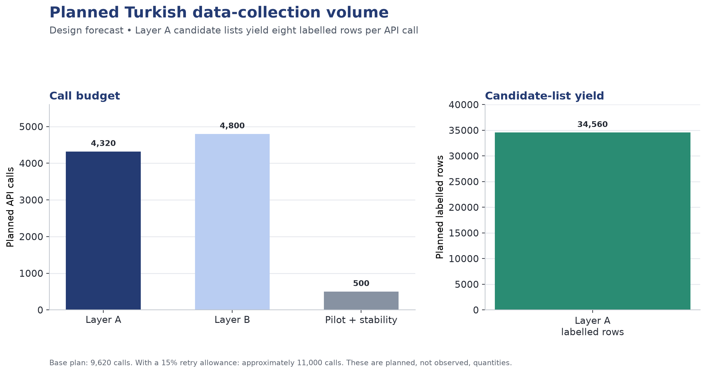
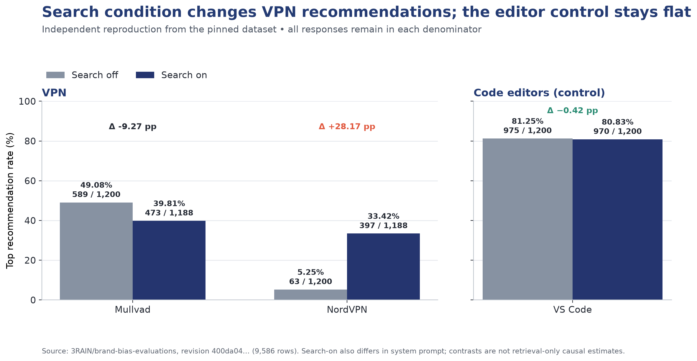
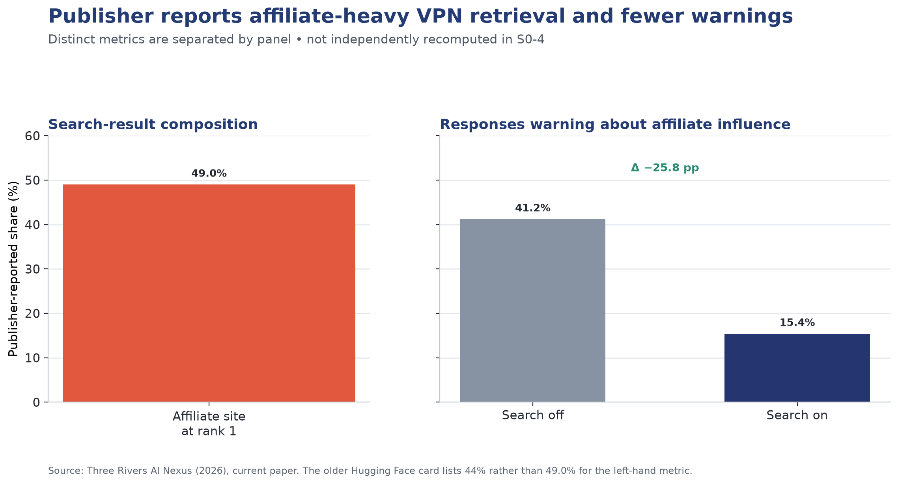

# Data Research

## Data for Measuring and Predicting Brand Visibility in AI Assistant Recommendations

**AI in Marketing Capstone** · Data Research Submission

---

## 1. Introduction

### 1.1 The marketing objective

The project's objective is to let a brand — and the agency working for it — answer three questions that are currently unanswerable: *Am I recommended by AI assistants? Why not? What should I change?*

Translated into measurable marketing terms:

| KPI | Definition | Business use |
|---|---|---|
| **AI Share of Voice (ASoV)** | % of category responses mentioning the brand | Channel presence benchmark |
| **Top-1 recommendation rate** | % of responses where the brand is the primary pick | Commercially decisive metric |
| **Mean rank** | Average position when mentioned | Prominence, not just presence |
| **Content-attributable visibility share** | Portion of visibility explained by content rather than brand recognition | Budget allocation: content spend vs brand spend |

### 1.2 What data is required

To compute ASoV we need many assistant responses to realistic category queries, repeated enough times to average out sampling noise. To attribute visibility we additionally need, for every response, **the web content the model actually saw** — otherwise content effects and brand-recognition effects are inseparable. To estimate causal content effects we need the same brand described in systematically varied ways.

No single existing dataset satisfies all three. Our data strategy therefore combines one open reference dataset, one dataset we generate ourselves, and one secondary benchmark for generalisation testing.

---

## 2. Data Source and Scope

### 2.1 Primary reference dataset — `3RAIN/brand-bias-evaluations`

| Attribute | Detail |
|---|---|
| **Source** | Three Rivers AI Nexus (2026), published on Hugging Face |
| **Access** | Open, MIT License, `datasets` library |
| **Type** | Third-party, public; machine-generated (model responses), not personal data |
| **Size** | 9,586 responses |
| **Time period** | Collected 2026 |
| **Granularity** | One row per model response; nested fields per row |
| **Coverage** | 4 models × 4 domains (VPN, travel, hosting, code editors) × 10 queries per domain × 2 conditions × up to 30 repetitions; 9,586 of 9,600 planned responses completed |
| **Pinned revision** | `400da04eced51d3afe52b6d20c0207fd613f8a4a` |
| **Key fields** | Response text; queries the model issued; full organic search results retrieved; structured labels extracted by a judge model (`top_recommendation`, `brand_mentions` with position, caveat flags, `confidence_in_extraction`) |

**Why this dataset.** It is the only open resource that stores *what the model retrieved* alongside *what it recommended*. That pairing is what makes supervised learning of the recommendation decision possible, and it is what allows the commercial-content supply chain to be observed rather than assumed. The retrieval on/off design is equally important: the no-retrieval condition gives us a direct empirical measure of each brand's prior recognition in model weights, which becomes the control variable in our attribution analysis.

**Marketing connection.** The four domains are considered-purchase categories where buyers routinely ask for recommendations, and where a shortlist of two or three names determines the outcome — structurally identical to the consumer categories our product targets.

### 2.2 Primary generated dataset — Turkish collection

No Turkish data exists in any published study. We generate our own, mirroring the reference schema so results are comparable.

**Layer A — Observational.** Real Turkish queries are issued; recommended brands, ranks and the retrieved organic results are recorded.
Scope: 3 sectors (cosmetics and personal care, accommodation and tourism, local services) × 12 queries per sector × 2 retrieval conditions × 3 models × 20–30 repetitions.

**Layer B — Interventional.** The same brand description is rewritten into controlled variants and the change in recommendation rate is measured.
Scope: 30 brands × 8 variants × 2 models × 10 repetitions. Variant grid: quantified evidence (present/absent) × certification or third-party attribution (present/absent) × specificity (specific/vague) × tone (technical/emotional), plus an untouched control description per brand.

**Brand universe.** Each sector contains globally known brands, well-known local brands, small local brands, and validated fictional brands as controls. Fictional names are validated in three steps — generation, elimination via web search, elimination via model-recognition probing — following the procedure established by Chu & Hou (2026).

**Data type.** First-party generated (we issue the calls and own the outputs), derived from third-party model APIs. Brand and product descriptions are drawn from public catalogues and public company websites. No customer or personal data is involved at any stage.

### 2.3 Secondary dataset — E-GEO

The E-GEO testbed (Bagga et al., 2025; GitHub) provides 7,000+ realistic e-commerce queries with product listings and fifteen rewriting heuristics. We use it only as a generalisation check: does a model trained on our data transfer to an independent English e-commerce setting?

### 2.4 Planned collection volume

Candidate-list design is the key efficiency decision: instead of asking about one brand per call, each call presents eight brands and requests a ranking, so a single API call yields eight labelled rows.

Base total ≈ 9,620 calls; with a 15% retry allowance ≈ 11,000 calls, roughly 12.7 million tokens. Estimated cost at current API rates is between $2 and $40 depending on model tier, halving again with batch pricing — a negligible constraint that allows us to increase repetitions from 20 to 30 for greater statistical power.

---

## 3. Data Quality, Privacy and Limitations

### 3.1 Data quality concerns

**Non-independence of repetitions.** With 20–30 repetitions per cell, rows are not independent samples. A random train/test split would leak near-duplicate rows across the boundary and inflate scores. **Mitigation:** grouped splitting at query level (`GroupKFold`), fixed once and version-controlled as `splits.json`, protected by an automated leakage test.

**Class imbalance.** Only one brand per response is the top recommendation; with candidate lists of eight, the positive class is roughly 12.5%. **Mitigation:** PR-AUC as the primary metric rather than accuracy, class weighting in tree models, and listwise formulation for the ranking task.

**Label noise from judge-model extraction.** The reference dataset's structured labels are produced by a model, not a human. In the pinned revision, 9,576 rows are `high`, seven are `medium`, and three are `low` confidence; all ten non-high rows belong to `travel_08`, so they do not affect the VPN/editor results below. **Mitigation:** S0-4 retains every row to reproduce the publisher's denominators. In the modelling sprint, confidence is treated as a quality flag, low-confidence rows are analysed separately, and sensitivity results are reported. A 100-row sample is manually verified by two team members with agreement reported.

**Parsing failure.** Turkish responses may not conform to the required output format. **Mitigation:** strict output templates, parsing unit tests, and per-model parse-success rates reported by cell; a model with markedly poor parse success is replaced.

**Position bias.** Prior work shows list position independently affects ranking. Without control, we would measure position rather than content. **Mitigation:** candidate order randomised across repetitions; position retained as an explicit feature.

**Sampling noise.** Temperature-based variation means identical prompts yield different answers. **Mitigation:** majority vote across repetitions as the final label; inter-repetition consistency reported.

**Representativeness and brand-universe skew.** The reference dataset's brand diversity is narrow — in the code-editor domain a single product dominates the great majority of responses. This limits how much can be learned about content effects in that domain. **Mitigation:** the domain is reported separately and functions as a natural control condition rather than a training source.

**Temporal validity.** Model versions change; a relationship learned today may not hold in three months. **Mitigation:** all collection completed within a two-week window; model version and timestamp recorded on every row; a stability re-run on a ~300-call subset quantifies drift.

### 3.2 Privacy and responsible use

No personal, customer or user data is collected or processed at any point. Inputs are synthetic personas and public brand information; outputs are model-generated text. The project therefore raises no consent, anonymisation or personal-data-protection obligations.

Two responsible-use considerations do apply. First, **provider terms:** collected responses are model outputs subject to the respective providers' terms of use, which is documented in the data card. Second, and more substantively, **dual-use risk:** the literature shows that fabricated authority claims — invented clinical citations, non-existent expert endorsements — are among the most effective visibility levers. A system that optimised visibility naively would surface fabrication as a tactic. Our recommendation layer is therefore constrained at code level to verifiable-evidence and source-diversity strategies, with a blocked-template list and an output filter that is unit-tested.

### 3.3 Access and coverage limitations

- The reference dataset covers digital services rather than consumer goods; findings transfer by structural analogy, not by direct equivalence.
- Only three commercial model families are practical within budget; open-weight models are out of scope.
- Retrieval behaviour depends on each provider's search tool, which is itself a moving target.
- Our Turkish collection covers three sectors; claims are scoped accordingly and not generalised to all markets.

---

## 4. Exploratory Analysis and Marketing Insights

S0-3/S0-4 downloaded the pinned dataset revision, parsed the structured JSON fields and independently reproduced the primary brand-shift result plus the code-editor control. The denominator in each rate is every response in the relevant category and condition, including rows whose extracted top recommendation is null. Repetitions are not treated as independent observations in later modelling; query-level grouped splitting remains mandatory.

### 4.1 Insight 1 — The search condition changes who wins, but not in every category

In the VPN category, NordVPN rises from `63/1,200 = 5.25%` under search-off to `397/1,188 = 33.42%` under search-on, a change of **+28.17 percentage points**. Mullvad moves in the opposite direction, from `589/1,200 = 49.08%` to `473/1,188 = 39.81%`. In the code-editor control, VS Code changes only from `975/1,200 = 81.25%` to `970/1,200 = 80.83%`, or **−0.42 percentage points**. These values exactly reproduce the pinned dataset; no confidence-based filtering was applied.

**Marketing interpretation.** The association between condition and recommendation is strongly category-dependent. The VPN result is consistent with a content-sensitive category, whereas the editor result is nearly flat. For a marketer this distinction helps identify categories where earned-media and content investment may move the shortlist. It should not be overstated as retrieval-only causality: in the source experiment, the search-enabled condition also uses a different system prompt.

### 4.2 Insight 2 — Publisher reports link affiliate-heavy retrieval with fewer warnings

The publisher's current paper reports that **49.0%** of top-ranked VPN search results are affiliate sites. Separately, responses containing an affiliate-influence warning fall from **41.2%** under search-off to **15.4%** under search-on. These values have different units and denominators, so Figure 2 presents them in separate panels. They were not independently recomputed in S0-4 and remain publisher-reported. An older Hugging Face dataset-card summary lists 44% for the first statistic; this report follows the current paper and records the version difference rather than silently combining them.

**Marketing interpretation.** The publisher's joint pattern is consistent with a transparency risk: search-enabled answers contain fewer warnings even though affiliate sources are common in the retrieved material. It does not, by itself, prove that affiliate sources caused the warning decline; that hypothesis requires row-level source classification and controlled analysis. For marketers, it still identifies third-party coverage and source diversity as variables worth measuring rather than assuming.

### 4.3 Insight 3 — Prior recognition is measurable and separable

The retrieval on/off design yields, for each brand, a recommendation rate under no external information. This is a direct empirical proxy for brand strength inside model weights — effectively an unaided-awareness measure for the AI channel — and it is the control variable that makes our attribution analysis possible.

**Marketing interpretation.** This is the pivot from measurement to diagnosis. Two brands with identical ASoV of 12% may require entirely different investments: one is unknown to the model and needs sustained brand-building; the other is known but poorly described and can be fixed with weeks of content work. Reporting these separately is the single most commercially useful output of the project.

### 4.4 Planned analyses on the full dataset

The two acceptance findings above and the data-quality checks were completed in S0-4. The broader descriptive baseline below is planned across S0-4 extensions and later modelling sprints:

| Analysis | Marketing question answered |
|---|---|
| ASoV distribution by brand and domain | Who holds share of voice in each category? |
| Concentration (Gini coefficient) of visibility per domain | How winner-takes-all is each category? |
| Top-1 rate by retrieval condition, per domain | Where does content matter and where does prior dominate? |
| Source-type composition of top-ranked results | How commercialised is each category's content supply? |
| Model-by-model comparison of local vs global brand share | Which assistant treats challengers most fairly? |
| Inter-repetition consistency by cell | How stable are recommendations, and how many repetitions do we need? |
| Parse success and label confidence by cell | Which cells are trustworthy for modelling? |

Reproduction code is committed to `notebooks/S0-4-reference-validation.ipynb`, with the concise validation record in `reports/referans_dogrulama.md`. S0-4 meets its acceptance criterion by reproducing the VPN shift and editor control exactly.

---

## 5. Conclusion

The data situation is favourable for the next stage of the capstone.

The reference dataset is directly suitable for the core supervised-learning task: it is open, appropriately licensed, sufficiently large, and — uniquely — pairs retrieved content with the resulting recommendation, which is precisely the pairing our research questions require. Its principal weaknesses are narrow brand diversity, non-consumer domains, and model-generated labels. All three are addressable through scope-limited claims, grouped splitting, and manual label verification.

The Turkish collection is feasible within both budget and schedule: approximately 11,000 calls at negligible cost, with the candidate-list design providing an eightfold efficiency gain. It fills the clearest gap in the literature and produces an asset — the first open Turkish brand-visibility dataset — that outlives the capstone.

Together the two datasets support every KPI defined in Section 1: ASoV and top-1 rate come directly from Layer A and the reference data; content-attributable visibility share requires the retrieval on/off contrast plus the masking ablation; and the causal content prescriptions require Layer B's controlled variants. No planned analysis lacks the data to support it.

The one genuine risk is temporal: model behaviour drifts, and our findings describe the channel as it behaves during a specific two-week window. We treat this as a finding to quantify via the stability re-run rather than a limitation to disclaim, and it justifies the product's requirement for periodic re-measurement.

---

## 6. References

Aggarwal, P., Murahari, V., Rajpurohit, T., Kalyan, A., Narasimhan, K. & Deshpande, A. (2024). *GEO: Generative Engine Optimization.* Proceedings of KDD 2024, pp. 50–61.

Bagga, P. S., Wu, Y., Aggarwal, P. & Deshpande, A. (2025). *E-GEO: A Testbed for Generative Engine Optimization in E-Commerce.* arXiv:2511.20867. Code: github.com/psbagga17/E-GEO

Chu, X. & Hou, Y. (2026). *Incumbent Advantage: Brand Bias and Cognitive Manipulation Dynamics in LLM Recommendation Systems.* arXiv:2606.17443.

Filandrianos, G., Dimitriou, A., Lymperaiou, M., Thomas, K. & Stamou, G. (2025). *Bias Beware: The Impact of Cognitive Biases on LLM-Driven Product Recommendations.* Proceedings of EMNLP 2025.

Kamruzzaman, M., Nguyen, H. M. & Kim, G. L. (2024). *"Global is good, local is bad?": Understanding Brand Bias in LLMs.* Proceedings of EMNLP 2024, pp. 12704–12721.

Pfrommer, S., Bai, Y., Gautam, T. & Sojoudi, S. (2024). *Ranking Manipulation for Conversational Search Engines.* Proceedings of EMNLP 2024, pp. 9520–9534.

Three Rivers AI Nexus (2026). *What Brands Does Your AI Prefer?* Dataset: `3RAIN/brand-bias-evaluations`, Hugging Face, MIT License. https://huggingface.co/datasets/3RAIN/brand-bias-evaluations

Three Rivers AI Nexus (2026). *What Brands Does Your AI Prefer? Search Results Dramatically Shift LLM Brand Recommendations.* Paper and validation code. https://github.com/ThreeRiversAINexus/brand-bias-evaluations

*Note on figures.* Figure 1 is independently reproduced from pinned Hugging Face revision `400da04eced51d3afe52b6d20c0207fd613f8a4a` using all category/condition responses as denominators. Figure 2 visualises current-paper statistics that remain publisher-reported and flags the older dataset-card discrepancy. Figure 3 shows this project's planned collection volume; it is a design estimate, not an observed result.
